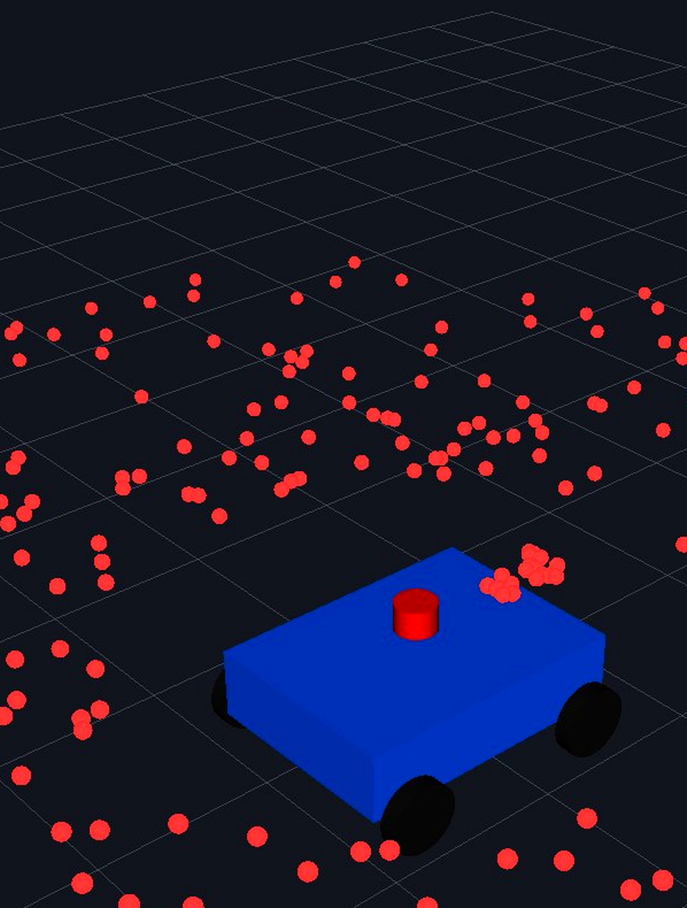

# Mini-AMR — ROS 2 Autonomous Mobile Robot

A simulated Autonomous Mobile Robot (AMR) built incrementally across a series of
tasks, from the URDF robot description through teleoperation and SLAM mapping,
culminating in **Nav2 map-based autonomous navigation**.

Tested with **ROS 2 Jazzy** on Ubuntu 24.04 (WSL2).

<p align="center">
  
</p>

> *3D view of the Mini-AMR URDF model with the live LiDAR scan cloud in RViz2.*

**[📊 Full presentation deck](deliverables/ROS2_MiniAMR_Presentation.pptx)** — 10 slides with embedded demo video clips for every stage (robot modeling, LiDAR/safety, SLAM, Nav2), plus speaker notes.

## Key Results

- **ROS 2 Jazzy** on Ubuntu 24.04
- **SLAM Toolbox** — occupancy-grid mapping from LiDAR
- **Nav2** — autonomous navigation (localization → global planning → control)
- **Goal reached successfully** — behaviour-tree result `SUCCEEDED`
- **Position error: 3.6 cm** (goal `(1.00, 0.80)` reached at `(1.004, 0.836)`)

---

## 1. Project overview

The project demonstrates a complete mobile-robot software stack in simulation,
without Gazebo: the robot is driven by lightweight "fake" sensor and odometry
nodes so the whole pipeline runs on any machine that has ROS 2 and Nav2.

The stack covers four capabilities, each runnable from its own launch file:

| Capability | What it does | Launch file |
|------------|--------------|-------------|
| **Robot description** | 4-wheel robot + LiDAR defined in URDF/xacro, visualised in RViz2 | `display.launch.py` |
| **Teleoperation** | Drive the robot with the keyboard; odometry integrates `/cmd_vel` | `robot.launch.py` |
| **SLAM mapping** | Build an occupancy grid from LiDAR with `slam_toolbox` | `slam_demo.launch.py` |
| **Autonomous navigation** | Localize on a saved map and drive to a goal with Nav2 | `navigation.launch.py` |

**Result:** the robot localizes on the saved map, plans a global path, follows it
and reaches the goal — goal `(1.00, 0.80)` reached at `(1.004, 0.836)`, a **3.6 cm**
final error, behaviour-tree result `SUCCEEDED`.

---

## 2. System architecture

The simulation replaces hardware with two nodes: `fake_odom_publisher` integrates
`/cmd_vel` into odometry (this is what actually moves the robot), and
`fake_scan_publisher` produces a synthetic LiDAR scan. Everything above them is
the real ROS 2 / Nav2 stack.

### Data flow

```
                 keyboard                     Nav2 controller
            teleop_twist_keyboard   ──┐   ┌──  (controller_server)
                                      │   │
                                      ▼   ▼
                                    /cmd_vel  (geometry_msgs/Twist)
                                        │
                                        ▼
                            fake_odom_publisher
                                        │
                        /odom  +  TF odom → base_footprint
                                        │
   fake_scan_publisher ──► /scan ──►  SLAM (slam_toolbox)   → /map, TF map → odom
        (laser_link)          └────►  Nav2 (AMCL)           → TF map → odom
                                        │
                              planner_server → /plan
                                        │
                              controller_server → /cmd_vel  (closes the loop)
```

### TF tree

```
map ──► odom ──► base_footprint ──► base_link ──► front_left_wheel
 │        │            │                     ├──► front_right_wheel
 │        │            │                     ├──► rear_left_wheel
 │        │            │                     ├──► rear_right_wheel
 │        │            │                     └──► laser_link
 │        │            └── fake_odom_publisher (moving)
 │        └── AMCL (navigation) or slam_toolbox (mapping)
 └── fixed frame used by RViz during mapping / navigation
```

`robot_state_publisher` publishes the fixed URDF links; `joint_state_publisher`
supplies joint states for the four *continuous* wheel joints so the wheel frames
exist and the RViz **RobotModel** renders without errors.

### Key topics and interfaces

| Interface | Type | Role |
|-----------|------|------|
| `/cmd_vel` | `geometry_msgs/Twist` | Velocity command (teleop or Nav2 controller) |
| `/odom` | `nav_msgs/Odometry` | Odometry from `fake_odom_publisher` |
| `/scan` | `sensor_msgs/LaserScan` | Simulated LiDAR in the `laser_link` frame |
| `/map` | `nav_msgs/OccupancyGrid` | Map from `slam_toolbox` or `map_server` |
| `/plan` | `nav_msgs/Path` | Global path from `planner_server` |
| `/initialpose` | `geometry_msgs/PoseWithCovarianceStamped` | AMCL initial pose |
| `/navigate_to_pose` | `nav2_msgs/action/NavigateToPose` | Navigation goal action |

> **Note:** the `fake_scan_publisher` node takes a `pattern` parameter —
> `random` (default, used for SLAM) or `clear`, an open-space scan used during
> navigation so AMCL localization stays stable.

---

## 3. ROS 2 packages

| Package | Nodes (`ros2 run` executables) | Launch files | Other contents |
|---------|-------------------------------|--------------|----------------|
| `mini_amr_description` | — | `display.launch.py` | `urdf/mini_amr.urdf.xacro`, `rviz/mini_amr.rviz`, `rviz/task4_rviz_config.rviz` |
| `mini_amr_control` | `fake_odom_publisher`, `mecanum_kinematics_node`, `tf_broadcaster` | — | Motion control and simulated odometry |
| `mini_amr_sensors` | `fake_scan_publisher`, `scan_analyzer_node`, `safety_zone_marker`, `tf_broadcaster` | — | `rviz/mini_amr_safety.rviz` |
| `mini_amr_bringup` | — | `robot.launch.py`, `slam_demo.launch.py` | Robot bringup and SLAM demo |
| `mini_amr_navigation` | `nav_demo_recorder` | `navigation.launch.py` | `config/nav2_params.yaml`, `maps/`, `rviz/nav2.rviz`, `rviz/slam.rviz` |

---

## 4. Build

```bash
cd ~/amr_ws
colcon build
source install/setup.bash
```

Build a single package while iterating:

```bash
colcon build --packages-select mini_amr_navigation
```

---

## 5. Launch instructions

### Robot model only (URDF in RViz2)

```bash
ros2 launch mini_amr_description display.launch.py
```

Starts `joint_state_publisher`, `robot_state_publisher` and RViz2 with
`mini_amr.rviz`.

### Robot bringup (model + simulated sensors)

```bash
ros2 launch mini_amr_bringup robot.launch.py
```

Starts `robot_state_publisher`, `fake_odom_publisher` and `fake_scan_publisher`.
This launch file does **not** start RViz2 or `joint_state_publisher`; add them if
you want the wheels to render:

```bash
ros2 run joint_state_publisher joint_state_publisher
rviz2
```

### Teleoperation

With `robot.launch.py` running, drive the robot from a second terminal:

```bash
ros2 run teleop_twist_keyboard teleop_twist_keyboard
```

Keys: `i` forward · `,` backward · `j` / `l` rotate · `U` / `O` diagonal
(holonomic strafe) · `k` stop.

---

## 6. SLAM mapping

```bash
ros2 launch mini_amr_bringup slam_demo.launch.py
```

This starts `joint_state_publisher`, `robot_state_publisher`,
`fake_odom_publisher`, `fake_scan_publisher`, `slam_toolbox`
(`async_slam_toolbox_node`), a `nav2_lifecycle_manager` and RViz2.

> `slam_toolbox` is a **lifecycle node** in ROS 2 Jazzy — it stays `unconfigured`
> (no `/scan` subscription, no `/map`, no `map → odom` TF) until it is activated.
> The included `nav2_lifecycle_manager` configures and activates it
> automatically, so mapping starts on launch.

Drive the robot around with teleop so the LiDAR sweeps the area:

```bash
ros2 run teleop_twist_keyboard teleop_twist_keyboard
```

Watch the **Map** display in RViz2 fill in. When you are happy with the map,
save it:

```bash
ros2 run nav2_map_server map_saver_cli -f ~/amr_ws/my_map
```

This writes `my_map.pgm` and `my_map.yaml`, which can be fed straight into the
navigation launch file via the `map:=` argument.

---

## 7. Nav2 autonomous navigation

```bash
ros2 launch mini_amr_navigation navigation.launch.py
```

This brings up the robot description, `fake_odom_publisher`,
`fake_scan_publisher` (in `clear` mode), the full Nav2 stack
(`map_server` + AMCL + planner + controller + behaviours + `bt_navigator` +
lifecycle manager) and RViz2 with `nav2.rviz`.

### Launch arguments

| Argument | Default | Description |
|----------|---------|-------------|
| `map` | `<pkg>/maps/task11_map.yaml` | Saved map YAML to navigate on |
| `params_file` | `<pkg>/config/nav2_params.yaml` | Nav2 parameter file |
| `use_sim_time` | `false` | Use `/clock` simulation time |
| `use_rviz` | `true` | Start RViz2 (`false` for headless runs) |

```bash
# headless (no RViz)
ros2 launch mini_amr_navigation navigation.launch.py use_rviz:=false

# navigate on a different saved map
ros2 launch mini_amr_navigation navigation.launch.py map:=/path/to/my_map.yaml
```

### Setting the initial pose

AMCL self-initializes at the map origin (`set_initial_pose` in
`nav2_params.yaml`), so the stack activates deterministically. To re-seed it, use
the RViz **2D Pose Estimate** tool, or publish it directly:

```bash
ros2 topic pub --once /initialpose geometry_msgs/msg/PoseWithCovarianceStamped \
  '{header: {frame_id: "map"}, pose: {pose: {position: {x: 0.0, y: 0.0},
     orientation: {z: 0.0, w: 1.0}}}}'
```

### Sending a goal

> The RViz **"2D Goal Pose"** tool only publishes to `/goal_pose`, which Nav2
> does **not** subscribe to. Use the **Nav2 Goal** tool, or send the action:

```bash
ros2 action send_goal /navigate_to_pose nav2_msgs/action/NavigateToPose \
  "{pose: {header: {frame_id: map}, pose: {position: {x: 1.0, y: 0.8},
     orientation: {w: 1.0}}}}"
```

The robot plans a global path (`/plan`, shown green in RViz), follows it, and
reports `SUCCEEDED` on arrival.

### Recording a run

`mini_amr_navigation` ships a helper node that drives one complete navigation run
and records the map, planned path, executed trajectory and result to JSON:

```bash
ros2 run mini_amr_navigation nav_demo_recorder --ros-args -p goal_x:=1.0 -p goal_y:=0.8
```

---

## 8. Demo video

[`deliverables/mini_amr_final_demo.mp4`](deliverables/mini_amr_final_demo.mp4) —
a 60-second walkthrough of the whole project, recorded from a live RViz2 session
at **1920 × 1080**, 30 fps.

| Time | Segment |
|------|---------|
| 0–5 s | Title — *Mini-AMR ROS2 Autonomous Mobile Robot* |
| 5–15 s | **Robot model** — URDF, TF tree and LaserScan in RViz2 |
| 15–25 s | **Motion control** — `teleop_twist_keyboard`: forward, backward, rotation, diagonal |
| 25–40 s | **SLAM mapping** — occupancy map built live from LiDAR scans |
| 40–55 s | **Autonomous navigation** — initial pose, goal `(1.0, 0.8)`, global path |
| 55–60 s | **Closing** — *Autonomous Navigation Completed Successfully* |

Shorter, per-stage clips (camera locked to the robot's own TF frame so it stays
centered) are embedded in the [presentation deck](deliverables/ROS2_MiniAMR_Presentation.pptx)
and also available standalone in `deliverables/`:

| Clip | Poster | Shows |
|------|--------|-------|
| `clip_robot.mp4` | `poster_robot.png` | URDF model driving with the live LaserScan |
| `clip_safety.mp4` | `poster_safety.png` | Safety-zone markers reacting to a near obstacle |
| `clip_slam.mp4` | `poster_slam.png` | Occupancy grid being built live by SLAM Toolbox |
| `clip_nav.mp4` | `poster_nav.png` | Nav2 planning a path and reaching the goal |

---

## 9. Deliverables

All submission artefacts live in [`deliverables/`](deliverables/):

| File | Description |
|------|-------------|
| `ROS2_MiniAMR_Presentation.pptx` | Full 10-slide conference-style deck with embedded demo videos and speaker notes |
| `Mini_AMR_Final_Report.pdf` / `.docx` | Final written technical report |
| `mini_amr_final_demo.mp4` | 60 s / 1920×1080 walkthrough of the full project |
| `nav_goal_new.png` | Poster frame for the master demo video |
| `title_hero_new.png` | 3D robot model + LiDAR scan cover image |
| `clip_robot.mp4` / `poster_robot.png` | Robot model + live LaserScan, camera locked to the robot |
| `clip_safety.mp4` / `poster_safety.png` | Safety-zone markers reacting to a near obstacle |
| `clip_slam.mp4` / `poster_slam.png` | SLAM Toolbox building the occupancy grid live |
| `clip_nav.mp4` / `poster_nav.png` | Nav2 planning a path and reaching the goal |

> All four `clip_*.mp4` files are recorded fresh from live ROS 2 / RViz2
> sessions with the camera's `Target Frame` locked to `base_footprint`, so the
> robot stays centered in frame regardless of where it drives.

---

## Repository layout

```
amr_ws/
├── src/
│   ├── mini_amr_description/   URDF/xacro model + RViz configs
│   ├── mini_amr_control/       odometry & motion control nodes
│   ├── mini_amr_sensors/       simulated LiDAR & safety nodes
│   ├── mini_amr_bringup/       robot bringup + SLAM demo launch files
│   └── mini_amr_navigation/
│       ├── config/             nav2_params.yaml
│       ├── launch/             navigation.launch.py
│       ├── maps/               task10_map (raw SLAM), task11_map (denoised, default)
│       └── rviz/               nav2.rviz, slam.rviz
├── deliverables/               presentation, report, demo video + per-stage clips, posters
├── tools/                      denoise_map.py, record_nav.sh, plot_nav.py
├── README.md
└── .gitignore
```

`build/`, `install/` and `log/` are not committed — run `colcon build` after
cloning.

---

## License

This project is licensed under the Apache License 2.0.
See the LICENSE file for details.
